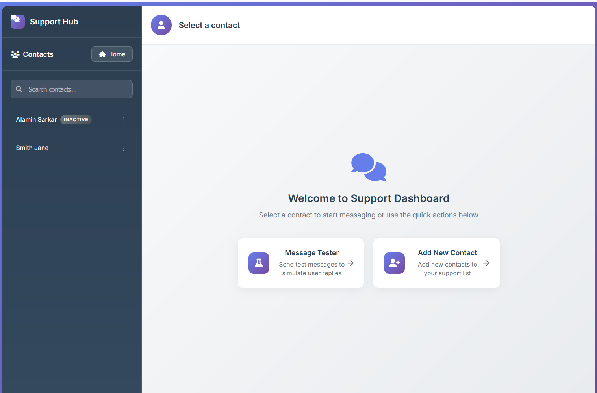
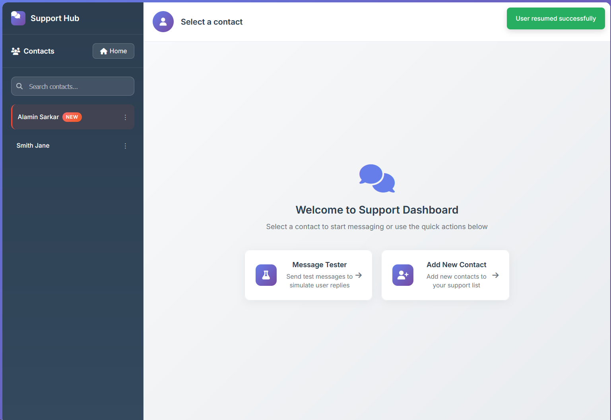
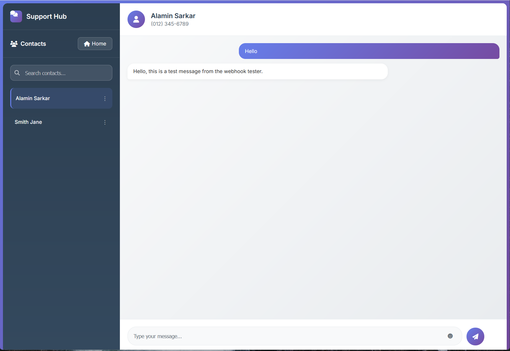
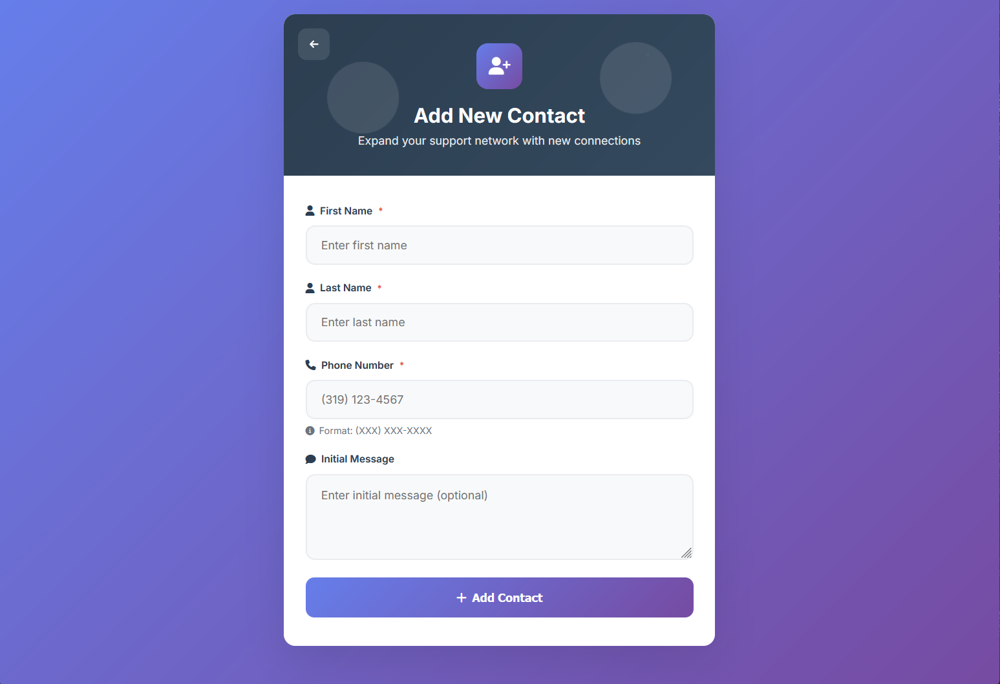
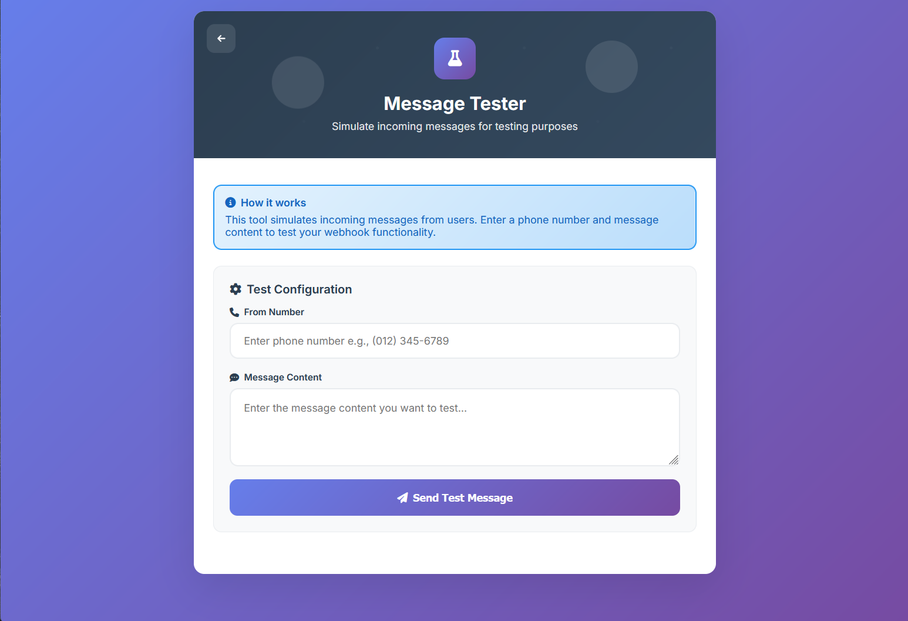

# 🚀 Twilio Powered - Customer Support Hub
<br><br>
# 📋 Project Overview

A comprehensive real-time **SMS support management system** built with **Flask** and integrated with **Twilio API** for seamless customer communication. This web application enables support teams to manage conversations, handle incoming SMS, and provide efficient customer service through a centralized dashboard.

---
## 🖼️ Screenshots

### Dashboard Interface  




### Real-time Chat Interface  


### Contact Management  


### Message Tester  



---

## 🎥 Demo Video


*(Click the image to watch the full demo video)*
---

## ✨ Key Features

### 🎯 Core Functionality

* **Real-time SMS Communication** – Send and receive SMS via Twilio integration
* **Contact Management** – Add, edit, pause, resume, and delete contacts
* **Live Chat Interface** – WhatsApp-style UI with real-time updates
* **Message History** – Full conversation tracking with timestamps
* **Unread Tracking** – Indicators for new messages with auto-read updates
* **User Status Management** – Active/Inactive status controls

### 🔧 Advanced Features

* **Auto-refresh** – Updates contact list & messages every 5 seconds
* **Search Functionality** – Quick filtering and search
* **Load More Pagination** – Efficient progressive loading
* **Message Testing Tool** – Webhook tester for simulating incoming messages
* **Responsive Design** – Mobile-first with glassmorphism UI
* **Notification System** – Toast feedback for actions

---

## 🛠️ Technology Stack

### Backend

* **Flask** – Python framework for API & backend
* **SQLite/PostgreSQL** – Database for contacts & messages
* **Twilio API** – SMS gateway integration
* **RESTful APIs** – Clean architecture for communication

### Frontend

* **HTML5 + CSS3** – Semantic markup & styling
* **JavaScript (ES6+)** – Dynamic features
* **Font Awesome** – Icons
* **Google Fonts** – Inter typography
* **CSS Grid & Flexbox** – Responsive layouts

### Design & UX

* **Modern UI/UX** – Gradient backgrounds & smooth animations
* **Glassmorphism** – Frosted glass aesthetic
* **Mobile Responsive** – Works on all devices
* **Accessibility** – WCAG compliant

---

## 🏗️ System Architecture

```
┌─────────────────┐    ┌──────────────────┐    ┌─────────────────┐
│   Twilio API    │◄──►│  Flask Backend   │◄──►│   Database      │
│   (SMS Gateway) │    │  (Python/Flask)  │    │(SQLite/Postgres)│
└─────────────────┘    └──────────────────┘    └─────────────────┘
                              │
                              ▼
                    ┌──────────────────┐
                    │  Web Frontend    │
                    │ (HTML/CSS/JS)    │
                    └──────────────────┘
```

---

## 🚀 Deployment & Hosting

* **Linux Server** – Deployed on Linux environment
* **Production Ready** – Error handling & optimizations
* **Env Configurations** – Dev & Prod separation
* **SSL/HTTPS** – Secure communication

---

## 📱 User Interface Highlights

### Dashboard

* **Sidebar Navigation** – Contact list with search/status
* **Chat Interface** – Real-time bubble-style messaging
* **Header Information** – Active user details
* **Action Menus** – Pause/Resume/Delete contacts

### Admin Tools

* **Add Contact Form** – Manage new customers
* **Message Tester** – Webhook testing interface
* **Status Management** – User activity controls

---

## 🎯 Business Impact

* **Faster Responses** – Real-time updates
* **Centralized Communication** – Single hub for all SMS
* **Improved Productivity** – Streamlined workflow
* **Enhanced Customer Experience** – Professional UI
* **Scalable** – Built to grow with user base

---

## 🔒 Security & Reliability

* **API Security** – Twilio webhook validation
* **Data Protection** – Secure storage & handling
* **Error Handling** – Comprehensive feedback
* **Rate Limiting** – API abuse prevention

---

## 📊 Performance Optimizations

* **Efficient Polling** – Optimized auto-refresh
* **Pagination** – Load-more feature for performance
* **Caching** – Faster data retrieval
* **Progressive Loading** – Smooth user experience

---

## 🏆 Project Achievements

✅ Full-stack development (frontend + backend)
✅ Twilio API integration
✅ Real-time messaging & auto-refresh
✅ Modern UI/UX with responsive design
✅ Production-ready deployment
✅ Scalable architecture

---

## 📌 Conclusion

This project demonstrates expertise in **full-stack web development**, **API integration**, **real-time applications**, and **modern UI/UX principles**.
